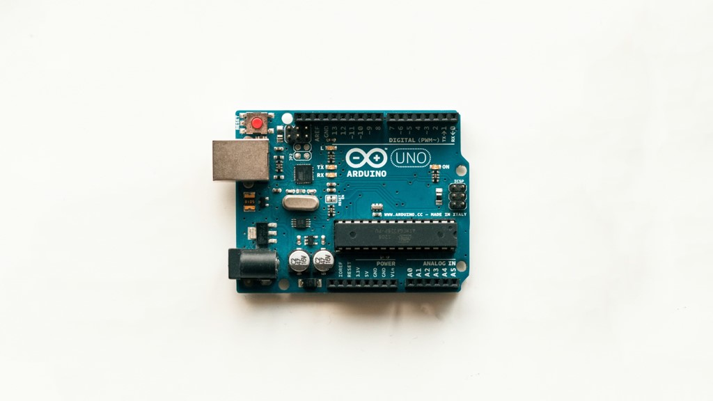

# Arduino LED & Melody Projects 💡🎵

This repository contains two simple and interactive Arduino projects demonstrating LED control, arrays, button input, and buzzer sound.

---

## 📂 Project 1: LED Sequence

**File:** `led_sequence.ino`

**Description:**  
A basic example of controlling multiple LEDs using an array and a for loop. Each LED turns ON for 500ms, then turns OFF sequentially.

**Features:**
- Control multiple LEDs using an array
- Sequential LED blinking
- Simple and beginner-friendly

**Hardware Required:**
- Arduino Uno (or compatible board)
- 3 LEDs
- 3 × 220Ω resistors
- Breadboard & jumper wires

**Pin Configuration:**
| Component | Pin |
|-----------|-----|
| LED 1     | 5   |
| LED 2     | 7   |
| LED 3     | 8   |

**Usage:**
1. Upload the `led_sequence.ino` sketch to your Arduino board.
2. LEDs will blink sequentially with a 500ms delay.

---

## 📂 Project 2: LED + Buzzer + Melody

**File:** `led_melody.ino`

**Description:**  
An interactive project combining LEDs, a buzzer, and a button. When the button is pressed, LEDs blink one by one with a short beep, followed by a happy melody.

**Features:**
- Multiple LEDs controlled using an array
- Buzzer sound effects and melody using `tone()`
- Button input with internal pull-up resistor
- Audio-visual feedback without using a screen
- Clean and beginner-friendly Arduino code

**Hardware Required:**
- Arduino Uno (or compatible board)
- 3 LEDs
- 3 × 220Ω resistors
- Buzzer (active or passive)
- Push button
- Breadboard & jumper wires

**Pin Configuration:**
| Component | Pin |
|-----------|-----|
| LED 1     | 5   |
| LED 2     | 7   |
| LED 3     | 8   |
| Buzzer    | 10  |
| Button    | 12  |

**Usage:**
1. Upload the `led_melody.ino` sketch to your Arduino board.
2. Press the button:
   - LEDs turn ON sequentially with a short beep
   - After the sequence, a happy melody is played

**Notes:**
- Button uses internal pull-up resistor (`INPUT_PULLUP`)
- Short press = triggers LED sequence + melody
- Delay prevents repeated triggering

---

## 🚀 Skills Learned
- Managing multiple pins using arrays
- LED control and sequencing
- Generating sound using `tone()`
- Handling button input (`INPUT_PULLUP`)
- Audio-visual feedback design without a screen
- Writing clean and readable Arduino code

---

## 📌 Suggested GitHub Commit Messages
- `Add basic LED sequence using array and for loop`
- `Add LED + Buzzer + Melody with button control`
- `Refactor LED control using arrays and loops`
- `Implement melody playback with tone()`

---

## 📸 Demo
_Add photos or video of both projects here to show the LEDs and melody in action._

---

## 🛠️ Future Improvements
- Implement multiple modes with different melodies
- Use `millis()` to avoid blocking delays
- Save last mode in EEPROM
- Add Game Mode / reaction testing
- Audio feedback for each mode